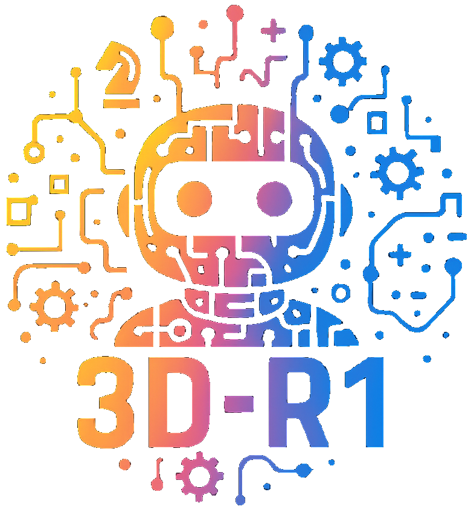

# 3D-R1: Enhancing Reasoning in 3D VLMs for Unified Scene Understanding

This is the official repository for the paper:
> **3D-R1: Enhancing Reasoning in 3D VLMs for Unified Scene Understanding**
>
> [Ting Huang](https://github.com/Believeht029)\*, [Zeyu Zhang](https://steve-zeyu-zhang.github.io/)\*<sup>†</sup>, and [Hao Tang](https://ha0tang.github.io/)<sup>#</sup>
>
> \*Equal contribution. <sup>†</sup>Project lead. <sup>#</sup>Corresponding author.
>
> ### [Paper](https://arxiv.org/abs/2507.23478) | [Website](https://aigeeksgroup.github.io/3D-R1) | [Data](https://huggingface.co/datasets/AIGeeksGroup/Scene-30K) | [Models](https://huggingface.co/AIGeeksGroup/3D-R1) | [HF Paper]()

> [!NOTE]
> 💪 This and following visualizations show the **zero-shot** results of 3D-R1 in various complex scenes, demonstrating its incredible generalizability and state-of-the-art performance.

https://github.com/user-attachments/assets/45fa0d43-d30e-4211-9194-defd60d8f9c4

## 🏃 Intro 3D-R1
3D-R1 is an open-source **generalist** model that enhances the reasoning of 3D VLMs for unified scene understanding.

Large vision-language models (VLMs) have made significant strides in 2D visual understanding tasks, sparking interest in extending these capabilities to 3D scene understanding.
However, current 3D VLMs often struggle with robust reasoning and generalization due to limitations in high-quality spatial data and the static nature of viewpoint assumptions.
To address these challenges, we propose **3D-R1**, a foundation model that enhances the reasoning capabilities of 3D VLMs.
Specifically, we first construct a high-quality synthetic dataset with CoT, named Scene-30K, leveraging existing 3D-VL datasets and a data engine based on Gemini 2.5 Pro. It serves as cold-start initialization data for 3D-R1.
Moreover, we leverage RLHF policy such as GRPO in the reinforcement learning training process to enhance reasoning capabilities and introduce three reward functions: a perception reward, a semantic similarity reward and a format reward to maintain detection accuracy and answer semantic precision.
Furthermore, we introduce a dynamic view selection strategy that adaptively chooses the most informative perspectives for 3D scene understanding.
Extensive experiments demonstrate that 3D-R1 delivers an average improvement of 10\% across various 3D scene benchmarks, highlighting its effectiveness in enhancing reasoning and generalization in 3D scene understanding.


## 📰 News
<b>2025/08/01:</b> 📣 Our paper has been promoted by <a href="https://zhuanlan.zhihu.com/p/1934643503331256268"><b>52CV</b></a>.

## TODO List

- [x] Upload our paper to arXiv and build project pages.
- [x] Upload the code.
- [x] Release Scene-30K dataset. (see [Scene-30K](https://huggingface.co/datasets/AIGeeksGroup/Scene-30K))
- [ ] Add a demo on huggingface.

## ⚡ Quick Start
### Environment Setup

Our code is tested with CUDA 11.8 and Python 3.9.16. To run the codes, you should first install the following packages:
```
h5py
scipy
cython
plyfile
'trimesh>=2.35.39,<2.35.40'
'networkx>=2.2,<2.3'
'torch=2.0.1+cu118'
```
After that, build the `pointnet2` and accelerated `giou` from source:
```bash
# PointNet++
pip install "git+git://github.com/erikwijmans/Pointnet2_PyTorch.git#egg=pointnet2_ops&subdirectory=pointnet2_ops_lib"

cd utils
python cython_compile.py build_ext --inplace
```
### Data Preparation
#### Download and Prepare the ScanNet 3D Data
You can download the pre-processed data from [here](https://huggingface.co/datasets/AIGeeksGroup/ScanQA).
Process 3D data: Follow the instructions [here](https://github.com/daveredrum/Scan2Cap/blob/main/data/scannet/README.md) and download the ScanNetV2 dataset.

#### Prepare Language Annotations

To train the model, you are required to prepare language annotations from `ScanRefer`, `Nr3D`, `ScanQA`, and the ScanNet part of `3D-LLM`.

1. `ScanRefer`. Follow the commands [here](https://github.com/daveredrum/ScanRefer) to download the `ScanRefer` dataset.
2. `Nr3D`. Follow the commands [here](https://referit3d.github.io/#dataset) to download the `Nr3D` dataset.
3. `ScanQA`. Follow the commands [here](https://github.com/ATR-DBI/ScanQA/blob/main/docs/dataset.md) to download the `ScanQA` dataset.
4. `3D-LLM`. The data are located at [here](https://vis-www.cs.umass.edu/3dllm/).

#### Download Pre-trained LLM weights
If your server has no trouble auto-downloading weights from huggingface🤗, feel free to skip this step.

Download files from the `Qwen2.5-VL-7B-Instruct` checkpoint at [huggingface](https://huggingface.co/Qwen/Qwen2.5-VL-7B-Instruct).

## 💻 Train your own models
### SFT Training
We provide training scripts in the `scripts` folder with different LLM backends. Feel free to modify the hyper parameters in those commands.
SFT on Scene-30K as a cold-start:
```bash
bash scripts/train.generalist.sh
```


## ✏️ Citation
```
@article{huang20253d-r1,
  title={3D-R1: Enhancing Reasoning in 3D VLMs for Unified Scene Understanding},
  author={Huang, Ting and Zhang, Zeyu and Tang, Hao},
  journal={arXiv preprint arXiv:2507.23478},
  year={2025}
}
```

---

## 👩🏻‍💻 Case Study

<table>
  <tr>
    <td  align="center" valign="top">
      <b>3D Scene Dense Captioning (3D-DC)</b>
      <video src="https://github.com/user-attachments/assets/34ebbb05-6fc2-4c9e-a957-955c54edaf70"  controls></video><br>
    </td>
    <td  align="center" valign="top">
      <b>3D Object Captioning</b>
      <video src="https://github.com/user-attachments/assets/87d70ed8-aed5-48a7-9e2c-fb35464f76d9"  controls></video><br>
    </td>
    </tr>
  <tr>
    <td  align="center" valign="top">
      <b>3D Visual Grounding (3D-VG)</b>
      <video src="https://github.com/user-attachments/assets/703fe056-7a82-4921-9768-208b6d1dd9a0"  controls></video><br>
    </td>
    <td  align="center" valign="top">
      <b>3D Question Answering (3D-QA)</b>
      <video src="https://github.com/user-attachments/assets/3448dc2b-a015-4169-a9ea-df21289b2f63"  controls></video><br>
    </td>
    </tr>
  <tr>
    <td  align="center" valign="top">
      <b>3D Dialogue</b>
      <video src="https://github.com/user-attachments/assets/bf17fbb1-a3ef-4013-8526-f3495bc9fd35"  controls></video><br>
    </td>
    <td  align="center" valign="top">
      <b>3D Reasoning</b>
      <video src="https://github.com/user-attachments/assets/5eb4b5c8-5175-4751-91d6-7e936a47d8a2"  controls></video><br>
    </td>
    </tr>
  <tr>
    <td  align="center" valign="top">
      <b>3D Planning</b>
      <video src="https://github.com/user-attachments/assets/c41d3267-03b2-43f6-9102-261172c680b1"  controls></video><br>
    </td>
  </tr>
</table>

---

## 😘 Acknowledgement
We thank the authors of [Qwen](https://github.com/QwenLM/Qwen), [LSceneLLM](https://github.com/Hoyyyaard/LSceneLLM), [ARKit](https://github.com/apple/ARKitScenes), and [DeepSeek-Math](https://github.com/deepseek-ai/DeepSeek-Math) for their open-source code.
